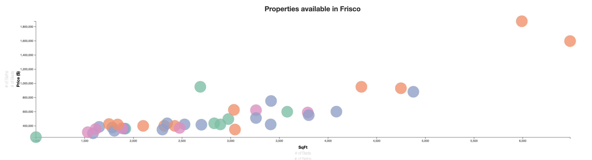

# Real Estate Analysis Sold vs. Current Price Action

## Objective
Most of the real estate websites provides an option of analyzing current and sold properties separately but not visiually together. Also, most real estate websites already have functions that lets you do a research on individual attributes and location information. In purchasing or listing a house, price action remains to be the key important attribute in the pricing for buying, selling and listing decisions.
The aim is to provide a visual solution to both the buyers and sellers to give the functionality for the user to review & analyze both current and sold properties together which could help for a much better listing or buying decision.

## ETL (Data Extraction Transform and Load)
 For this project the data has been scrapped from Redfin real estate website. 
 In order to have sufficient amount of data, we have extracted Sold and Currently listed properties of following 10 cities in Texas using BeautifulSoup in Python: 
- Dallas
- Fort Worth
- Plano
- Frisco
- Arlington
- Irving
- Southlake
- McKinney
- Colleyville
- Coppell

Also, to have data consistency, the following key attributes are being extracted from the Sold & Currently listed properties:
- Coordinates of property located (Latitude & Longitude extracted using GeoCod API)
- Price
- Number of Beds
- Number of Baths
- Square Ft. Area
- Address
- City
- ZipCode

Once extracted, the data was cleaned and transformed into json and csv format to load in JavaScript query to build webpages.

## Visualization
To analyze the extracted real estate data,The following visualizations have been built using JavaScipt Plotly and D3:

### 1. Cluster Map Chart
The objective of this visualization is to provide the user the flexibity to review the number of sold and currently avaialble properties using actual geographic map view. 
The following are features available in the map chart:
- Sold properties are shown in "green" color with different gradients based on the number of properties being sold. The more the properties sold, the darker the color is.
- Current available properties are shown in "red" color, with same different gradients based on number of properties being available.
- In order to give a customized color gradient based on number of properties sold/current listing, function "L.DivIcon" from "L.markerClusterGroup" is updated in JavaScript to have different class names in HTML and those class names are further used in CSS to define the color coding for each cluster group.
 
#### Insights
- At a higher level, we can observe that Frisco and Irving are hotspot areas as there are more than 100 properties being currently avaialble and more than 100 properties being sold in the past 6 months.
- On the other hand, we can see that in the past 6 months only ~20 properties being sold in Fort Worth area and around same number of properties are currently available as well.

### 2. Bar Chart
In order to further deep-dive ito the real estate analysis, as a next step, compartive bar charts are built to show the avg. prices of the properties being sold & avaialble across the number of beds. Following are the features available in the bar chart:
- User can interact with the bar chart using the dropdown filter which contains the City & ZipCode values
- On hovering on bar charts user can review the avg. prices corresponding to number of beds

#### Insights
- Following up on the above map chart insights, now we can further deep-dive into each of the cities (like Irving, Frisco and Fort Worth) to understand why Frisco & Irving are hotspot areas and why not Fort Worth.
- Also, using this visualization we can compare the avg. prices of properties across number of beds and analyze how much is the difference in the avg. prices of properties based on beds.
- For example, in "Frisco-75034" the avg. price of currently available properties for 3 beds is almostsame as vg. price of 2 beds.

### 3. Bubble Chart
The objective of this visualization is to provide user the more flexibility to analyze further at each propperty level for a particular city. This would be used as a final decision making visualization after analyzing previous two charts. Following are the features available in the bubble chart:
- Bubble chart is built using D3 Scalable Vector Graphics (SVG) to have the circle shape for each of the scatter points.
- Using D3 transition, user can interact with the X-Axis (SqFt, Beds, Baths) and Y-Axis (Price, Beds, Baths) to analyze different combination of metrics 
- On hovering on each bubble, corresponding x-axis and y-axis values can be seen along with the ZipCode.
#### Insights
- Here, by reviewing the properties through bubble chart user can make better decision based on different metrics
- For example, in "Frisco - 75036" we can observe that most properties available are between ~1,500 to ~2,500 Sq. Ft. area with prices between ~$310K to ~370K.
- Any user, who would be interested in buying property in this area, the inisghts from this view could be very valuable to make a better decision.

## Files Available
Here, please find following files for reference:
- Python jupyter notebook file for ETL process
- Index.html file used as web landing page
- Data sources in json and csv format
- JavaScipt files: for MapChart, BarChart and Bubble Chart
- css files for front end formatting
